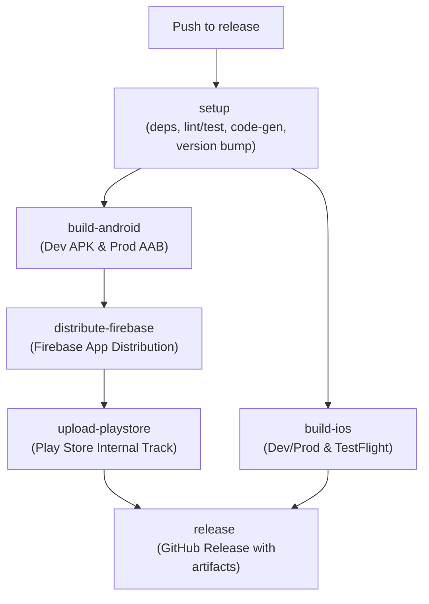

# 🚀 Flutter CI/CD — Unified Multi-Platform Release (iOS & Android)


This document explains how to set up, configure, and use the **`release.yml`** GitHub Actions workflow for your **Flutter Mobile** project.

---

## 🗺️ Quick Navigation

- [📋 Overview & Pipeline Flow](#-overview)
- [⚙️ Prerequisites & Setup Guides](#%EF%B8%8F-prerequisites)
  - [1. GitHub Repository Variables](#1-github-repository-variables)
  - [2. GitHub Repository Secrets](#2-github-repository-secrets)
  - [3. iOS Signing Credentials (Step-by-Step)](#3-ios-signing-credentials)
  - [4. Firebase & Play Store Credentials (Step-by-Step)](#4-firebase--google-play-credentials)
- [🛠️ Local Helper Scripts](#%EF%B8%8F-local-helper-scripts)
- [🧩 Key Design Decisions & Optimizations](#-key-design-decisions--optimizations)
- [🏗️ Jobs & Composite Actions Deep Dive](#-deep-dive-jobs--actions)
- [🧩 Optional Add-ons](#-template-add-ons)
  - [Live Activities / iOS Extensions](#1-live-activities--ios-app-extensions)
  - [Code Generation (build_runner)](#2-code-generation-build_runner)
  - [Dev vs. Prod Environments Configuration](#3-dev-vs-prod-environments)

---

## 📋 Overview

The workflow automates the full Android and iOS release pipeline whenever code is pushed to the `release` branch:



| Job | Purpose | Environment |
|-----|---------|-------------|
| `setup` | Increments version, resolves deps, runs tests/lints, `build_runner` | — |
| `build-android` | Builds Dev APK and Prod AAB | **Dev/Prod** (`.env` / `.prod.env`) |
| `build-ios` | Builds Dev and Prod IPA, uploads to TestFlight | **Dev/Prod** (`.env` / `.prod.env`) |
| `distribute-firebase`| Uploads APK to Firebase App Distribution | — |
| `upload-playstore`| Uploads AAB to Google Play Store (Internal Track) | — |
| `release` | Creates a tagged GitHub Release with zipped artifacts | — |


## 🛠️ Local Helper Scripts

The pipeline includes helper scripts located in the `scripts/` directory to simplify configuration and check repository settings before trigger runs.

### 1. Pre-flight GitHub Config Check (`scripts/precheck_github_config.sh` or `.bat`)
Validates that all necessary secrets and variables are fully configured on your remote repository.
```bash
# Run on macOS/Linux
./scripts/precheck_github_config.sh

# Run on Windows
.\scripts\precheck_github_config.bat
```

### 2. GitHub Variables Setup (`scripts/setup_github_variables.sh` or `.bat`)
Interactively configures all required repository variables on GitHub using the GitHub CLI (`gh`), saving you from manual entry.
```bash
# Run on macOS/Linux
./scripts/setup_github_variables.sh

# Run on Windows
.\scripts\setup_github_variables.bat
```
---

## ⚙️ Prerequisites

Follow these steps to integrate the release template into your Flutter project repository.

### 1. Copy Workflow Files
Copy the `.github` directory from this template to the root of your Flutter project repository. This includes:
- `.github/workflows/`: Main `release.yml` and reusable modular jobs.
- `.github/actions/`: Composite actions for environment setup, versioning, env-files, and failure reporting.

*Note: If your release branch is not named `release` (e.g., `main`), update the branch under the `on: push: branches:` section in `.github/workflows/release.yml`.*

---

## 🔑 Configuration

Configure your repository variables and secrets in your GitHub Repository settings (**Settings → Secrets and variables → Actions**).

### 1. GitHub Repository Variables

Add these under the **Variables** tab or initialize them all at once using the CLI command below:

| Variable Name | Description | Example Value |
|---|---|---|
| `APP_V_MAJOR` | Major version component | `1` |
| `APP_V_MINOR` | Minor version component | `0` |
| `APP_V_PATCH` | Patch version component | `0` |
| `APP_V_BUILDNO` | Build number start state | `1` |
| `FLUTTER_VERSION` | Target Flutter SDK version | `3.41.3` |
| `IOS_TEAM_ID` | Apple Developer Team ID | `JWAJ23K392` |
| `IOS_MAIN_PROFILE` | Provisioning profile name for Main App | `App Distribution` |

<details>
<summary><b>🛠️ CLI Command to initialize all variables</b></summary>

Run this command in your terminal to create all repository variables at once (replace value placeholders as needed):
```bash
for var in \
  "APP_V_MAJOR=1" \
  "APP_V_MINOR=0" \
  "APP_V_PATCH=0" \
  "APP_V_BUILDNO=1" \
  "FLUTTER_VERSION=3.41.3" \
  "IOS_TEAM_ID=JWAJ23K392" \
  "IOS_MAIN_PROFILE=App Distribution"
do
  gh variable set "${var%%=*}" -b "${var#*=}"
done
```
</details>

---

### 2. GitHub Repository Secrets

Add the following credentials under the **Secrets** tab:

| Secret Name | Category | Description |
|---|---|---|
| `REPO_ACCESS_TOKEN` | General | GitHub PAT with repo permissions for automatic version bumping |
| `DEV_ENV_FILE` | General | Full raw contents of the development `.env` file |
| `ENV_FILE` | General | Full raw contents of the production `.prod.env` file |
| `KEYSTORE_BASE64` | Android | Base64-encoded `.jks` keystore file |
| `KEY_STORE_PASSWORD` | Android | Keystore store password |
| `KEY_ALIAS` | Android | Keystore key alias |
| `KEY_PASSWORD` | Android | Keystore key password |
| `PLAY_STORE_SERVICE_ACCOUNT_JSON` | Android | Base64-encoded Google Play Store Service Account JSON |
| `FIREBASE_APP_ID` | Android | Firebase Android App ID (e.g., `1:1234567890:android:abcdef123456`) |
| `FIREBASE_TOKEN` | Android | Firebase CLI CI Refresh Token |
| `BUILD_CERTIFICATE_BASE64` | iOS | Base64-encoded Apple Distribution `.p12` certificate |
| `P12_PASSWORD` | iOS | Password for the `.p12` certificate |
| `KEYCHAIN_PASSWORD` | iOS | Temporary password for the macOS runner keychain |
| `BUILD_PROVISION_PROFILE_BASE64` | iOS | Base64-encoded provisioning profile for the main app |
| `APPSTORE_ISSUER_ID` | iOS | App Store Connect API Issuer ID |
| `APPSTORE_API_KEY_ID` | iOS | App Store Connect API Key ID |
| `APPSTORE_API_PRIVATE_KEY` | iOS | App Store Connect API Private Key (`.p8` file content) |

> [!NOTE]
> `DEV_ENV_FILE` and `ENV_FILE` must contain the **raw plaintext contents** of your environment files (do not base64 encode them). You can push them easily using the GitHub CLI:
> ```bash
> gh secret set DEV_ENV_FILE < .env
> gh secret set ENV_FILE < .prod.env
> ```

---

### 3. iOS Signing Credentials

Since GitHub Action runners start fresh every time, Apple certificates and provisioning profiles must be provided manually as GitHub Secrets. Follow the step-by-step guides below to generate and encode them:

<details>
<summary><b>🔑 Step 1: Create & Export Apple Distribution Certificate (.p12)</b></summary>

#### Option A: Full CLI Flow (Recommended if cert doesn't exist locally)
1. **Generate a CSR and private key on your Mac:**
   ```bash
   openssl req -nodes -newkey rsa:2048 \
     -keyout ~/Downloads/distribution.key \
     -out ~/Downloads/distribution.csr \
     -subj "/emailAddress=YOUR@EMAIL.com/CN=App Distribution/C=US"
   ```
2. **Upload the CSR to Apple Developer Portal:**
   - Go to [developer.apple.com/account/resources/certificates/list](https://developer.apple.com/account/resources/certificates/list).
   - If the `+` button says **"Maximum number of certificates generated"**, revoke one of the existing API Key Distribution certs.
   - Click `+` → select **Apple Distribution** → **Continue**.
   - Upload `~/Downloads/distribution.csr` → **Continue** → **Download**.
   - Save the downloaded `.cer` file to `~/Downloads/distribution.cer`.
3. **Convert the `.cer` + `.key` into a `.p12` bundle:**
   ```bash
   # Convert cert to PEM
   openssl x509 -in ~/Downloads/distribution.cer -inform DER \
     -out ~/Downloads/distribution.pem -outform PEM

   # Bundle PEM and private key (choose a secure password)
   openssl pkcs12 -export \
     -out ~/Downloads/distribution.p12 \
     -inkey ~/Downloads/distribution.key \
     -in ~/Downloads/distribution.pem \
     -name "Apple Distribution" \
     -passout pass:YOUR_CHOSEN_PASSWORD
   ```
4. **Base64 encode the `.p12` to copy to clipboard:**
   ```bash
   base64 -i ~/Downloads/distribution.p12 | pbcopy
   ```
   - Clipboard content becomes **`BUILD_CERTIFICATE_BASE64`**.
   - The password you chose becomes **`P12_PASSWORD`**.

#### Option B: Keychain Export (If cert already exists on your Mac)
1. Open **Keychain Access** → **My Certificates**.
2. Right-click **"Apple Distribution: [Your Name/Company]"** (must have a private key arrow ▶) → **Export** → save as `distribution.p12` → set a password.
3. Base64 encode and copy the file:
   ```bash
   base64 -i ~/Downloads/distribution.p12 | pbcopy
   ```
   - Clipboard content becomes **`BUILD_CERTIFICATE_BASE64`**.
   - The password you set during export becomes **`P12_PASSWORD`**.
</details>

<details>
<summary><b>📄 Step 2: Download Provisioning Profile (.mobileprovision)</b></summary>

1. Go to the [Apple Developer Account](https://developer.apple.com/account/) → **Certificates, Identifiers & Profiles** → **Profiles**.
2. Find the **App Store** (Distribution) profile for your App ID.
   > [!IMPORTANT]
   > Ensure the profile is linked to the **correct, active Distribution Certificate** generated in Step 1. If you created a new certificate, edit the profile, check the new certificate, save, and download.
3. Base64 encode the `.mobileprovision` file:
   ```bash
   base64 -i ~/Desktop/YourProfile.mobileprovision -o ~/Desktop/Profile_Base64.txt
   ```
4. Copy the entire contents of `Profile_Base64.txt` and set it as the GitHub Secret: **`BUILD_PROVISION_PROFILE_BASE64`**.
</details>

<details>
<summary><b>⚙️ Step 3: Generate App Store Connect API Key (.p8)</b></summary>

This key permits GitHub Actions to upload built IPAs directly to TestFlight without needing two-factor authentication (2FA).
1. Log into [App Store Connect](https://appstoreconnect.apple.com/) → **Users and Access** → **Integrations** tab.
2. Select **App Store Connect API** and click the `+` button to generate a new key.
3. Name it (e.g., `GitHub Actions CI`) and grant the **App Manager** role.
4. Copy the **Issuer ID** at the top → Save as GitHub Secret **`APPSTORE_ISSUER_ID`**.
5. Copy the **Key ID** in the new row → Save as GitHub Secret **`APPSTORE_API_KEY_ID`**.
6. Download the API Key file (`.p8`). Open it in a text editor, copy everything (including the header/footer), and save as GitHub Secret **`APPSTORE_API_PRIVATE_KEY`**.
</details>

---

### 4. Firebase & Google Play Credentials

To distribute Android builds, set up connections for Google Play Store and Firebase App Distribution.

<details>
<summary><b>🔥 Firebase App Distribution Setup</b></summary>

1. **Obtain Firebase App ID:**
   - Go to Firebase Console → Project Settings → General.
   - Scroll down to "Your apps", select the Android app, and copy the **App ID** (format: `1:1234567890:android:abcdef123456`).
   - Save in GitHub as Secret **`FIREBASE_APP_ID`**.
2. **Obtain Firebase CI Token:**
   - Install Firebase CLI locally, then run:
     ```bash
     firebase login:ci
     ```
   - Complete the browser sign-in. Copy the token outputted in the terminal and save as GitHub Secret **`FIREBASE_TOKEN`**.
3. **Tester Group Name (Optional):**
   - By default, `job_distribute_firebase.yml` distributes builds to a tester group named `testers`. To change this, modify the `groups:` field in `.github/workflows/job_distribute_firebase.yml`.
</details>

<details>
<summary><b>🤖 Google Play Store Internal Track Setup</b></summary>

1. **Create Google Cloud Service Account:**
   - Go to the [Google Cloud Console](https://console.cloud.google.com/) and select the project linked to your Google Play Console.
   - Navigate to **IAM & Admin > Service Accounts** and click **Create Service Account**.
   - Provide a name (e.g., `play-store-ci`), grant the **Service Account User** role, and save.
   - Click on the service account → **Keys** tab → **Add Key** → **Create new key** → **JSON**. Download the file.
2. **Configure the GitHub Secret:**
   - Base64 encode the JSON key file and copy it:
     ```bash
     base64 -i play-store-key.json | pbcopy
     ```
   - Paste as GitHub Secret **`PLAY_STORE_SERVICE_ACCOUNT_JSON`**.
3. **Invite Service Account to Play Console:**
   - Go to Google Play Console → Users & Permissions. Invite the service account email and grant **Release** permissions so it can upload app bundles.
</details>

---

## 🧩 Key Design Decisions & Optimizations

- **Modular Reusable Workflows:** Reusable jobs are split into separate `job_*.yml` files in `.github/workflows/`, orchestrated by `release.yml`.
- **Composite Actions:** Repetitive setup, version bumping, configuration, and teardown steps are extracted to `.github/actions/` to reduce runtime and YAML duplication.
- **Stateful Versioning via GitHub Variables:** We decouple versions from `pubspec.yaml` to avoid commit noise and merge conflicts. The `bump-version` action reads and increments `APP_V_PATCH` and `APP_V_BUILDNO` settings on the fly.
- **iOS Extension Version Syncing:** Using Apple's native command `agvtool` (`agvtool new-version -all`), the workflow synchronizes all sub-targets (e.g., Live Activities/Extensions) to match the main app's version, preventing App Store rejection.
- **Fail-Fast Workflow Cancellation:** If any parallel step fails (like an iOS code-sign error), a custom post-failure step creates a GitHub issue and executes `gh run cancel` to terminate the entire pipeline run, saving action minutes.

---

## 🏗️ Deep Dive: Jobs & Actions

### Jobs (`.github/workflows/`)

1. **`job_setup.yml` (Setup & Quality Gates):** Bumps version numbers, runs tests/lints (`flutter analyze --fatal-infos` and `flutter test`), and builds generated files.
2. **`job_build_android.yml` (Android Build):** Builds a Dev APK (via `.env`) and a Prod AAB (via `.prod.env`) in a single run.
3. **`job_build_ios.yml` (iOS Build & TestFlight):** Downloads signing certs and provisioning profiles into a temporary macOS keychain, runs `agvtool` synchronization, and builds/uploads Dev and Prod IPAs.
4. **`job_distribute_firebase.yml` (Firebase QA):** Pushes the Dev APK to Firebase App Distribution for immediate internal testing.
5. **`job_upload_playstore.yml` (Play Store Production):** Automatically pushes the Prod AAB to the Google Play Store internal track.
6. **`job_release.yml` (GitHub Release):** Runs after all jobs succeed to generate release notes, tag the commit, and publish zipped artifacts.

---

## 📁 Related Files & Scripts

| File / Directory | Description |
|---|---|
| [`release.yml`](.github/workflows/release.yml) | The main CI/CD workflow orchestrator |
| [`job_*.yml`](.github/workflows/) | Reusable workflows for each platform/task |
| [`setup-flutter-env/action.yml`](.github/actions/setup-flutter-env/action.yml) | Flutter setup composite action |
| [`bump-version/action.yml`](.github/actions/bump-version/action.yml) | Version bump composite action |
| [`scripts/precheck_github_config.sh`](scripts/precheck_github_config.sh) | GitHub variables & secrets validator |
| [`scripts/setup_github_variables.sh`](scripts/setup_github_variables.sh) | Interactive GitHub variables config tool |

---

## 🧩 Template Add-ons

Depending on your project's architecture, you may need to add back or modify certain features.

### 1. Live Activities / iOS App Extensions
If your application uses App Extensions (e.g., Live Activities, widgets), you must sign them with their own provisioning profiles.

<details>
<summary><b>🛠️ Step-by-Step Setup for Live Activities</b></summary>

1. **Create the Provisioning Profile:** Go to your Apple Developer Account and create an App Store Distribution profile for the extension's specific Bundle ID (e.g., `com.company.app.live-activities`).
2. **Export as Base64:** Download the `.mobileprovision` profile and run:
   ```bash
   base64 -i ~/Downloads/YourExtensionProfile.mobileprovision | pbcopy
   ```
3. **Add GitHub Secret:** Create a repository secret named `BUILD_PROVISION_PROFILE_LIVE_BASE64` and paste the value.
4. **Add GitHub Variable:** Create a repository variable named `IOS_LIVE_PROFILE` with the name of the profile.
5. **Modify `job_build_ios.yml`:** Install the Live Activities provisioning profile in `.github/workflows/job_build_ios.yml` by adding this step right after installing the main profile:
   ```yaml
   - name: Install Provisioning Profile (Live Activities Extension)
     run: |
       mkdir -p ~/Library/MobileDevice/Provisioning\ Profiles
       echo "${{ secrets.BUILD_PROVISION_PROFILE_LIVE_BASE64 }}" | base64 --decode > /tmp/live.mobileprovision
       UUID=$(security cms -D -i /tmp/live.mobileprovision | plutil -extract UUID xml1 -o - - | sed -n 's/.*<string>\(.*\)<\/string>.*/\1/p')
       cp /tmp/live.mobileprovision ~/Library/MobileDevice/Provisioning\ Profiles/${UUID}.mobileprovision
   ```
   Then pass the profile specifier to the Xcode configure ruby script step:
   ```yaml
   - name: Configure Xcode Project for Manual Signing
     env:
       DEVELOPMENT_TEAM: ${{ vars.IOS_TEAM_ID }}
       MAIN_PROFILE_SPECIFIER: ${{ vars.IOS_MAIN_PROFILE }}
       LIVE_ACTIVITY_PROFILE_SPECIFIER: ${{ vars.IOS_LIVE_PROFILE }}
     run: |
       gem install xcodeproj --quiet
       ruby scripts/configure_ios_signing.rb
   ```
</details>

### 2. Code Generation (build_runner)
If your project does not require code generation (e.g., `freezed`, `json_serializable`), you can remove the `build_runner` step in `job_setup.yml` to save execution time.

<details>
<summary><b>🛠️ How to Remove</b></summary>

Open `.github/workflows/job_setup.yml` and delete the following lines:
```yaml
- name: Run build_runner
  run: flutter pub run build_runner build --delete-conflicting-outputs
```
*(You can also remove the "Upload generated code" artifact step in `job_setup.yml` and the "Download generated code" artifact steps in the Android/iOS build jobs).*
</details>

### 3. Dev vs. Prod Environments
This template is configured to build both a **Development** version (using `.env`) and a **Production** version (using `.prod.env`) of your app.

<details>
<summary><b>🛠️ How to simplify to a single Production build</b></summary>

If you only need a single release build:
1. Provide the same base64 string for both `DEV_ENV_FILE` and `ENV_FILE` secrets.
2. OR manually delete the `Build APK (Dev)` step in `job_build_android.yml` and the `Build iOS IPA (Dev)` step in `job_build_ios.yml`.
3. If you remove the Dev builds, update `job_release.yml` so it only expects and zips the production build artifacts.
</details>

---

## 🔗 Reusing Workflows in Other Repositories

Because these workflows are designed as modular, reusable workflows, other developers can directly reference and call them from their own repositories without duplicating the workflow logic.

### 1. Repository Access Configuration
Ensure your repository's access settings allow others to read the workflows:
* Go to **Settings > Actions > General**.
* Under **Access**, select **"Accessible from repositories in this organization"** (for private/internal organization sharing) or ensure the repository is set to **Public** for global sharing.

### 2. Referencing a Reusable Job
Other developers can invoke individual jobs from this repository directly in their own `.github/workflows/` files. For example, to call the setup or build jobs:

```yaml
jobs:
  setup:
    uses: dinethsiriwardana/Flutter-Github-Action-for-Play-Store-and-Testflight/.github/workflows/job_setup.yml@master
    secrets: inherit

  build-android:
    needs: setup
    uses: dinethsiriwardana/Flutter-Github-Action-for-Play-Store-and-Testflight/.github/workflows/job_build_android.yml@master
    with:
      build_number: ${{ needs.setup.outputs.build_number }}
      version_name: ${{ needs.setup.outputs.version_name }}
    secrets: inherit
```

*You can replace `@master` with a specific commit SHA or release tag (e.g., `@v1.0.0`) to pin versions.*

